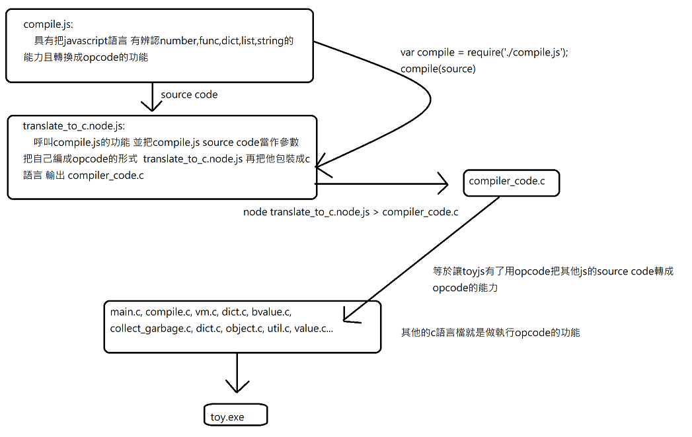
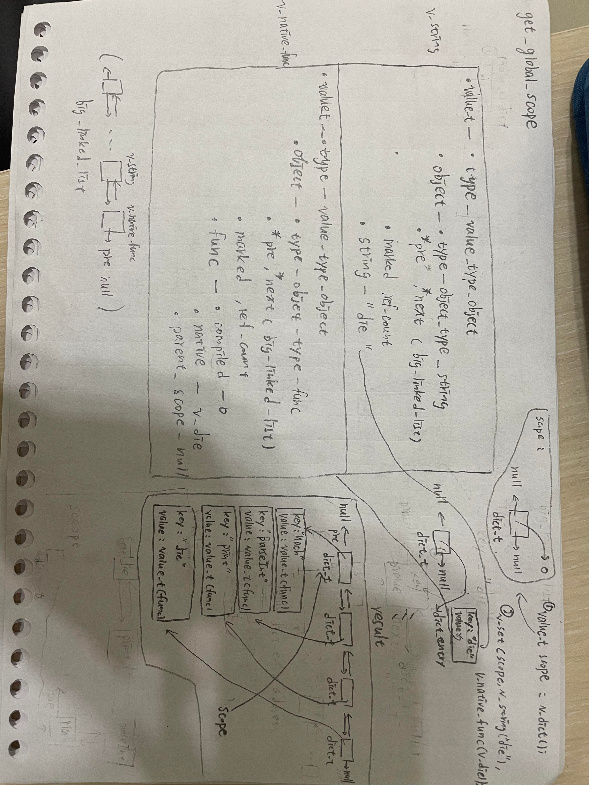
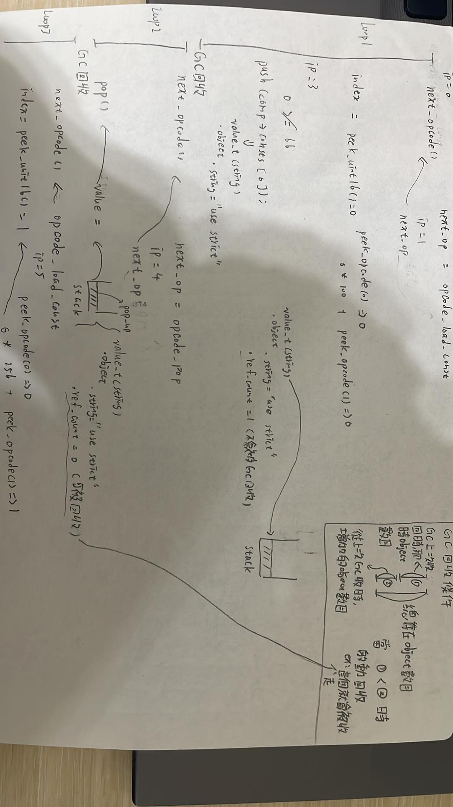
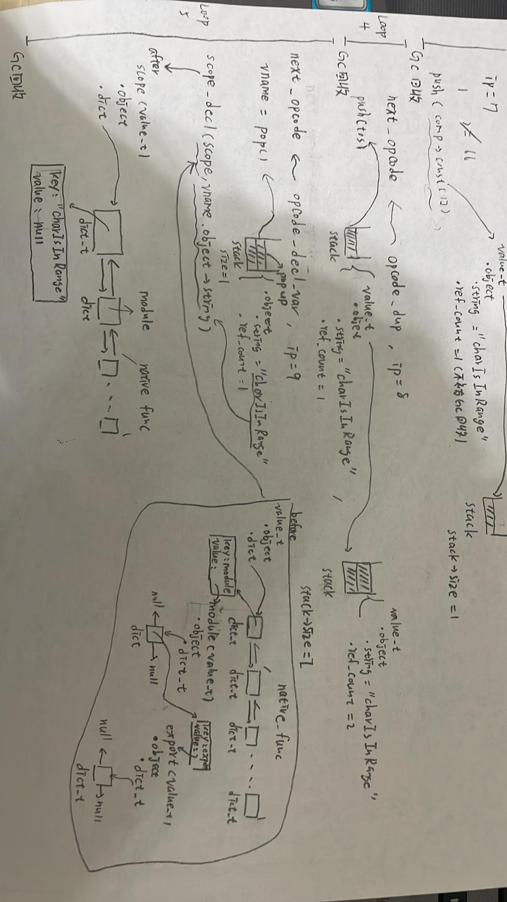
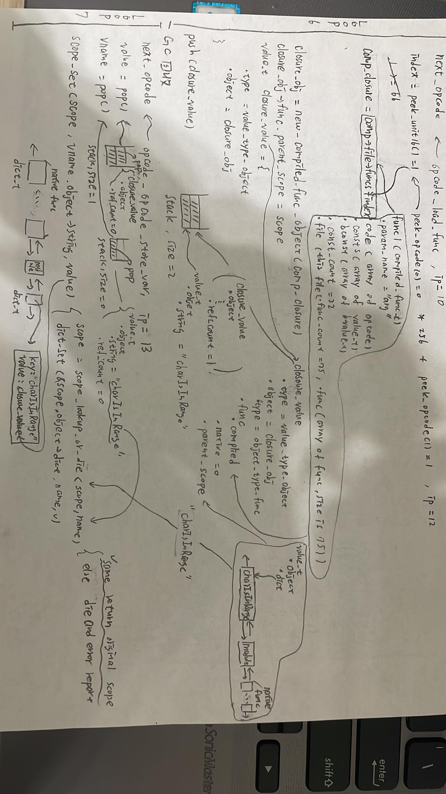
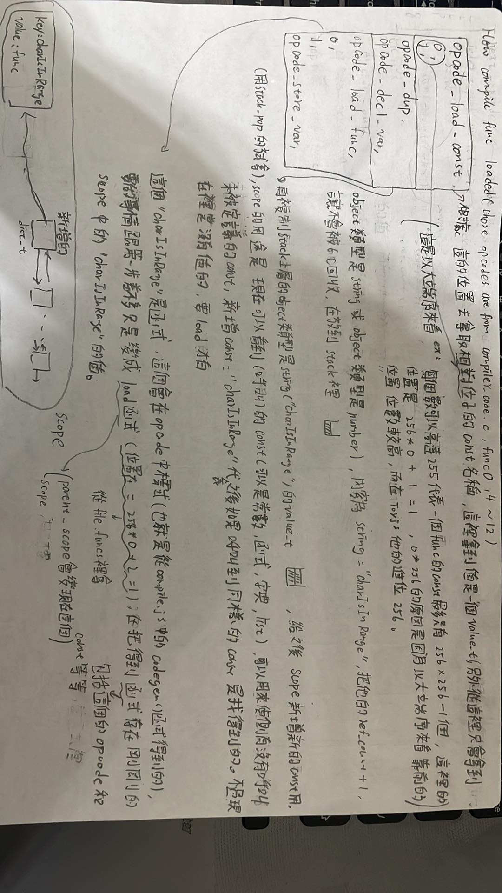
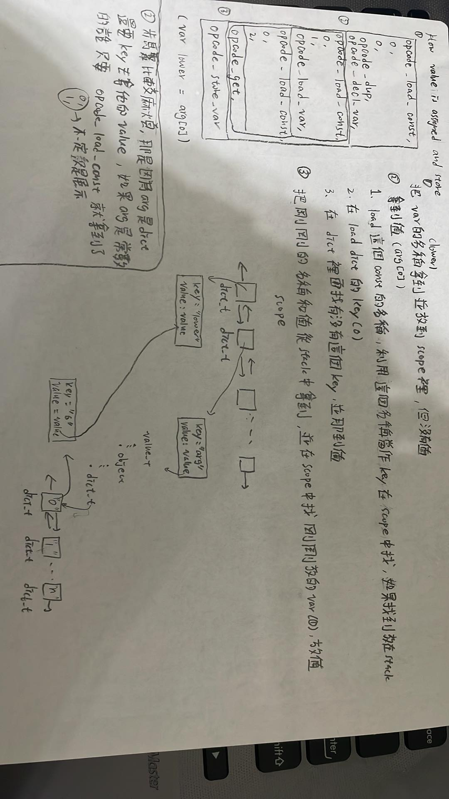
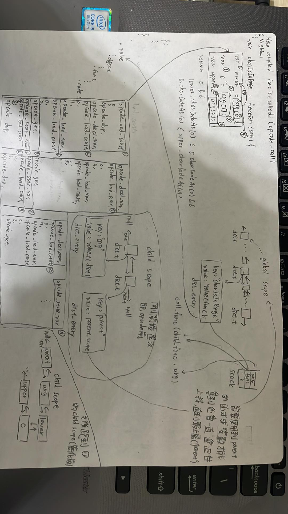

## Make



## ./toy file


----

先看 [value_t](./value_t.md)  這是Toyjs自訂的類型

## Main.c

```c
#include "toy.h"

int main(int argc, const char **argv) {
    if (argc <= 1) {
        die("invoke with a file name");
    }

    FILE *file = fopen(argv[1], "r"); //read file with given filename
    if (!file) {
        die("cannot open the given file");
    }

    size_t max_file_size = 64 * 1000; 
    char *source = xmalloc(max_file_size); //分配空間給讀入的原始碼
    size_t length = fread(source, 1, max_file_size, file); //把讀到的原始碼放到 source 並回傳總長度
    source[length] = 0;//最後一個放零告知原始碼到此為止
    eval_source(source);
    fclose(file);
    free(source);//釋放分配空間
    return 0;
}
```

**xmalloc**

```c
/// util.c
#define ASSERT_ENOUGH_MEM(v)                    \
    if (!v) {                                   \
        die("cannot allocate memory");          \
    }

void die(const char *error) {
    fprintf(stderr, "fatal: %s\n", error);
    exit(1);
}

void *xmalloc(size_t size) {
    void *d = malloc(size);
    ASSERT_ENOUGH_MEM(d); //判斷分配是否成功 如果沒有成功 錯誤回報並離開程式
    return d;
}
```

**eval_source**

```c
//compile.c


value_t eval_source(const char *source) {
    value_t compile_func = import_builtin_compiler_module();//拿到已經放好func的scope
    if (!v_is_func(compile_func)) {
        die("the builtin compiler module must export a function"); //錯誤回報 並離開程式
    }

    value_t compiled_funcs = call_func(compile_func, v_string(source));
    compiled_file_t *file = translate_compiled_file(compiled_funcs);
    value_t func = {
        .type = value_type_object,
        .object = new_compiled_func_object(file->funcs),
    };
    value_t result = eval_func(func, get_global_scope());
    free_compiled_file(file);
    collect_garbage();
    return result;
}
```

**import_builtin_compiler_module**

```c
//compile.c
static value_t import_builtin_compiler_module(void) {
    return import_nodejs_module(get_builtin_file_func(), get_global_scope());
}
```

**get_builtin_file_func()**

| 名子           | 類型                 | 內容                                          | 來自 |
| -------------- | -------------------- | --------------------------------------------- | ---- |
| compile_file_t | struct compiled_file | struct compiled_file                          | vm.h |
| compiled_file  | struct               | compiled_func_t *funcs;<br>size_t func_count; | vm.h |

```c
//compile.c

static value_t get_builtin_file_func(void) {
    //把bconsts陣列的值一一轉成value_t並放到一一consts中
    //為了之後 eval_func 時方便可以拿到統一的類型
    //以回傳指標的方式 節省時間和空間
    // compiled_file_t 中的 funcs指標可以拿到其他所有的func(75個)
    //可以用他在eval_func 時load其他已經compiled的func
    compiled_file_t *file = get_builtin_file();
    value_t vglobal = {
        .type = value_type_object,
        .object = new_compiled_func_object(file->funcs),
    };
    return vglobal;
}
```


**get_global_scope**

創造一個dict_t串鍊 在eval_func時 他會在當前scope(或這個scope以上的父層)尋找是否出現過同樣的名稱(key) 現在先放內建函式當呼叫到"die","print","parseInt"和"Math"時找得到他們與對應的函式

```c
static value_t v_die(value_t ctx, value_t message) {...}
static value_t v_print(value_t ctx, value_t message) {...}
static value_t v_parse_int(value_t ctx, value_t vstring) {...}
static value_t get_math(void) {...}

static value_t get_global_scope(void) {
    value_t scope = v_dict();
    v_set(scope, v_string("die"), v_native_func(v_die));
    v_set(scope, v_string("print"), v_native_func(v_print));
    v_set(scope, v_string("parseInt"), v_native_func(v_parse_int));
    v_set(scope, v_string("Math"), get_math());
    
    return scope;
}

```



**import_nodejs_module**

```c
static value_t import_nodejs_module(value_t file_func, value_t global_scope) {
    //有了用value_t包裝好的檔案 和 scope後
    value_t exports = v_dict();
    value_t module = v_dict();
    v_set(module, v_string("exports"), exports);
    v_set(global_scope, v_string("module"), module);//先把module和exports裝在scope裡
    eval_func(file_func, global_scope);  //再把用value_t包裝好的檔案 一一把裡面的函式 放到scope中
    return v_get(module, v_string("exports"));
}
```


**eval_func**

主要依靠scope,value_t 和stack_t的幫助來執行

* scope 儲存已經宣告過的東西, ex: 拿之前宣告的變數"a" 遍歷scope找key == "a"
* value_t 所有的資料都是使用 value_t儲存
* stack_t 放暫時的value_t

```c
value_t eval_func(value_t funcv, value_t scope) {
    v_assert_type(funcv, func);
    v_inc_ref(funcv);//不要被GC回收
    v_inc_ref(scope);//不要被GC回收
    //現在看到的
    func_t *func = &funcv.object->func;
    const compiled_func_t *comp = func->compiled;
    stackk_t stack = {};
    size_t ip = 0;

#define tos (stack_get_top(&stack))

#define push(v) stack_push(&stack, (v))
#define pop()   stack_pop(&stack)

#define peek_opcode(offset) (comp->code[ip + (offset)])

#define next_opcode()                           \
    ({                                          \
        enum opcode next__op = peek_opcode(0);  \
        ip++;                                   \
        next__op;                               \
    })

    // Big endian
#define peek_uint16()                                   \
    ((unsigned)peek_opcode(0) * 0x100 + peek_opcode(1)) \

    for (;;) {
        request_garbage_collection();

        enum opcode opcode = next_opcode();
        switch (opcode) {
        case opcode_return:
            v_dec_ref(funcv);
            v_dec_ref(scope);
            stack_flush(&stack);
            if (!stack.size) {
                return v_null;
            }
            return tos;

        case opcode_load_const: {
            unsigned index = peek_uint16();
            ip += 2;
            if (index >= comp->const_count) {
                die("load_const: const index out of range");
            }
            push(comp->consts[index]);
            break;
        }

        case opcode_load_null:
            push(v_null);
            break;

        case opcode_load_empty_list:
            push(v_list());
            break;

        case opcode_load_empty_dict:
            push(v_dict());
            break;

        case opcode_list_push: {
            value_t item = pop();
            value_t list = tos;
            v_assert_type(list, list);
            v_list_push(list, item);
            break;
        }

        case opcode_dict_push: {
            value_t value = pop();
            value_t key = pop();
            value_t dict = tos;
            v_set(dict, key, value);
            break;
        }

        case opcode_pop:
            pop();
            break;

        case opcode_decl_var: {
            value_t vname = pop();
            v_assert_type(vname, string);
            scope_decl(scope, vname.object->string);
            break;
        }

        case opcode_load_var: {
            value_t vname = pop();
            v_assert_type(vname, string);
            push(scope_get(scope, vname.object->string));
            break;
        }

        case opcode_load_func: {
            unsigned index = peek_uint16();
            ip += 2;
            if (index >= comp->file->func_count) {
                die("load_func: func index out of range");
            }
            compiled_func_t *comp_closure = comp->file->funcs + index;
            object_t *closure_obj = new_compiled_func_object(comp_closure);
            closure_obj->func.parent_scope = scope;
            value_t closure_value = {
                .type = value_type_object,
                .object = closure_obj,
            };
            push(closure_value);
            break;
        }

        case opcode_call: {
            value_t arg = pop();
            value_t child_func = pop();
            push(call_func(child_func, arg));
            break;
        }

        case opcode_store_var: {
            value_t value = pop();
            value_t vname = pop();
            v_assert_type(vname, string);
            scope_set(scope, vname.object->string, value);
            break;
        }

        case opcode_dup:
            push(tos);
            break;

        case opcode_goto:
            ip = peek_uint16();
            break;

        case opcode_goto_if: {
            unsigned next = peek_uint16();
            ip += 2;
            if (v_to_bool(pop())) {
                ip = next;
            }
            break;
        }

        case opcode_not:
            push(v_number(!v_to_bool(pop())));
            break;

        case opcode_unary_minus:
            push(v_number(-v_to_number(pop())));
            break;

        case opcode_typeof:
            push(v_string(v_typeof(pop())));
            break;

        case opcode_set: {
            value_t key = pop();
            value_t dict = pop();
            value_t new_value = pop();
            v_set(dict, key, new_value);
            break;
        }

        case opcode_get: {
            value_t key = pop();
            value_t dict = pop();
            push(v_get(dict, key));
            break;
        }

        case opcode_rot: {
            value_t a = pop();
            value_t b = pop();
            push(a);
            push(b);
            break;
        }

#define case_bin_op(name)                       \
            case opcode_##name: {               \
                value_t _right = pop();         \
                value_t _left = pop();          \
                push(v_##name(_left, _right));  \
                break;                          \
            }

        case_bin_op(add) case_bin_op(sub)
        case_bin_op(mul) case_bin_op(div) case_bin_op(mod)
        case_bin_op(eq) case_bin_op(neq)
        case_bin_op(gt) case_bin_op(lt)
        case_bin_op(gte) case_bin_op(lte)
        case_bin_op(in)

        default:
            die(v_to_string(v_add(v_string("unknown opcode "),
                                  v_number(opcode))));
        }
    }
}

```


以下是跑圖片是寫到charIsInRange 函式加載好

對應 compiler_code.c中的func0的code

```c
static compiled_func_t func0 = {
  .code = (unsigned char[]){
     /* 0 */ opcode_load_const,
    /* 1 */ 0,
    /* 2 */ 0,
    /* 3 */ opcode_pop,
    /* 4 */ opcode_load_const,
    /* 5 */ 0,
    /* 6 */ 1,
    /* 7 */ opcode_dup,
    /* 8 */ opcode_decl_var,
    /* 9 */ opcode_load_func,
    /* 10 */ 0,
    /* 11 */ 1,
    /* 12 */ opcode_store_var,
    .
    .
    .
  }
```

```js
// compiler.js
'use strict';

///////////////////////////////////////////////////////// PARSING


var charIsInRange = function (arg) {
    var lower = arg[0];
    var c = arg[1]; // falsy if eof
    var upper = arg[2];
    return c &&
           lower.charCodeAt(0) <= c.charCodeAt(0) &&
           c.charCodeAt(0) <= upper.charCodeAt(0);
};
.
.
.
```








Loop1 ~ Loop2 可以看到 `use strict` 被load 但因為沒有把它存下來或做其他的動作 他就直接被stack 拿掉

Loop3 ~ 5 在load 一個名稱是 `charIsInRange` 的const 一樣先放在 stack 但與`use strict`不一樣的是他有被assign 一個函式我們先把他記錄起來, 用scope(dict_t串鍊)的方式 這樣之後要找他只要去遍歷那個scope的就好, 這時只是記錄他的名稱 目前值是什麼還不知道 

Loop 6 ~ 7 這裡才在把剛剛放在scope裡的`charIsInRange`的值填上 這個值是來自我們剛剛傳進來的參數 funcv 他裡面有一個指標可以指向下一個函式就用那個指標把值填上去 之後呼叫到 `charIsInRange` 時只要用scope尋找 找到後在跑他裡面的值就好了


以下是eval_func的總結







TODO:how func return

### 補充

#### big edian(大端序)

##### 位元組序

* 來源 :[位元組順序 - 維基百科，自由的百科全書 (wikipedia.org)](https://zh.wikipedia.org/zh-tw/字节序)

電腦記憶體中或在數位通訊鏈路中，組成多位元組的字的位元組的排列順序。

**Example**

`int`的變數`x`位址為`0x100`，那麼其對應位址表達式`&x`的值為`0x100`。且`x`的四個位元組將被儲存在電腦記憶體的`0x100, 0x101, 0x102, 0x103`位置

##### 大端序與小端序

位元組的排列方式有兩個通用規則。例如，將一個多位數的低位放在較小的位址處，高位放在較大的位址處，則稱**小端序**；反之則稱**大端序**。

例如假設上述變數`x`類型為`int`，位於位址`0x100`處，它的值為`0x01234567`，位址範圍為`0x100~0x103`位元組，其內部排列順序依賴於機器的類型。大端法從首位開始將是：`0x100: 0x01, 0x101: 0x23,..`。而小端法將是：`0x100: 0x67, 0x101: 0x45,..`。


**大端序 Example** (圖的來源:[位元組順序 - 維基百科，自由的百科全書 (wikipedia.org)](https://zh.wikipedia.org/zh-tw/字节序))


**import_nodejs_module**

放好file_func在scope之後 有了把source code轉成opcode的能力了 這個能力(函式)儲存在scope中的key == "codegen"

exports 可以藉由 scope_lookup 拿到那個能力(函式)

之後只要把source code轉opcode 利用eval_func在執行剛剛轉的opcode就好了

```c
static value_t scope_lookup(value_t scope, const char *name) {
    if (dict_has(&scope.object->dict, name)) {
        return scope;
    }
    value_t parent = dict_get(&scope.object->dict, "<parent>");
    if (!v_is_null(parent)) {
        return scope_lookup(parent, name);
    }
    return v_null;
}
```

```c
static value_t import_nodejs_module(value_t file_func, value_t global_scope) {
    value_t exports = v_dict();
    value_t module = v_dict();
    v_set(module, v_string("exports"), exports);
    v_set(global_scope, v_string("module"), module);
    eval_func(file_func, global_scope);
    return v_get(module, v_string("exports"));
}
```

目前scope的樣子


**eval_source**

```c
//compile.c


value_t eval_source(const char *source) {
    value_t compile_func = import_builtin_compiler_module(); //有了轉source code 成opcode的函式
    if (!v_is_func(compile_func)) {
        die("the builtin compiler module must export a function"); //錯誤回報 並來開程式
    }

    value_t compiled_funcs = call_func(compile_func, v_string(source));
    compiled_file_t *file = translate_compiled_file(compiled_funcs);
    value_t func = {
        .type = value_type_object,
        .object = new_compiled_func_object(file->funcs),
    };
    value_t result = eval_func(func, get_global_scope());
    free_compiled_file(file);
    collect_garbage();
    return result;
}
```


