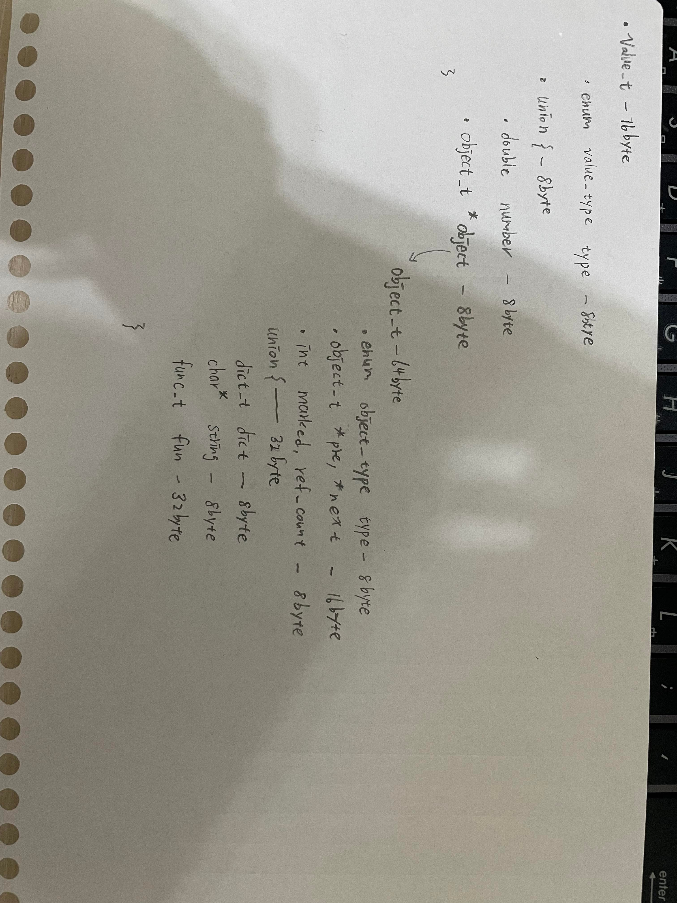
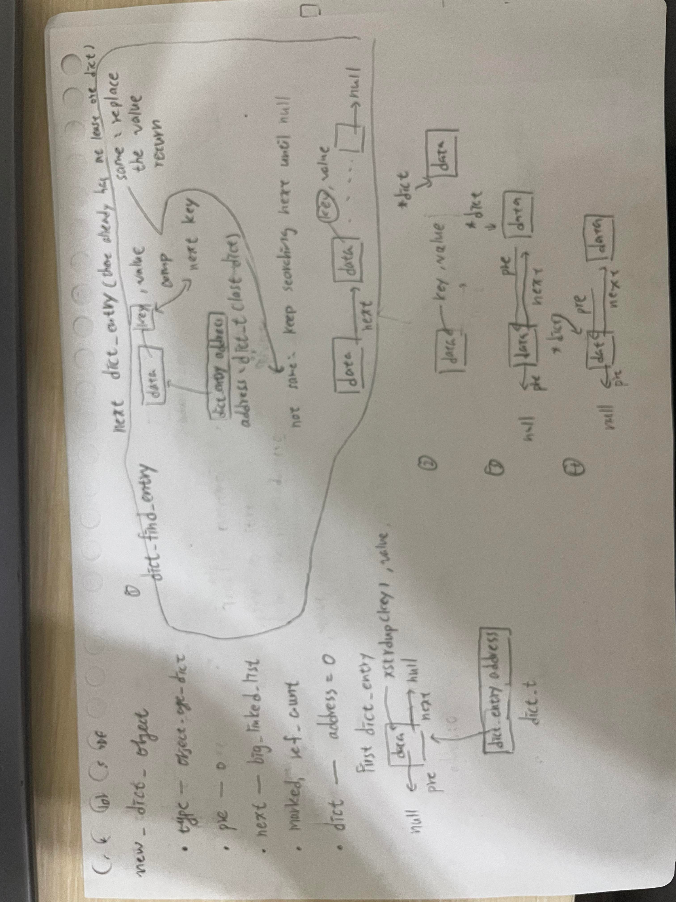
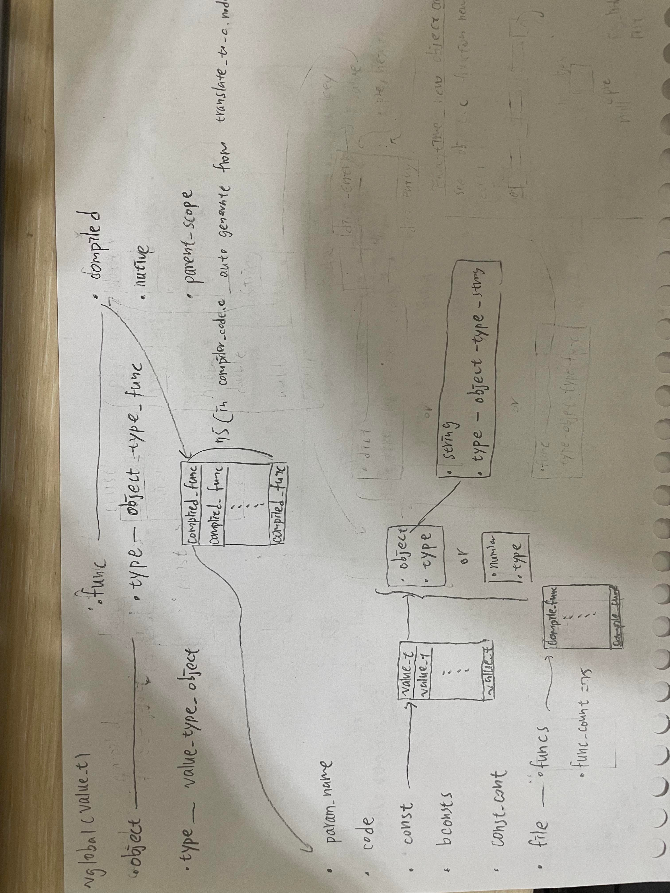
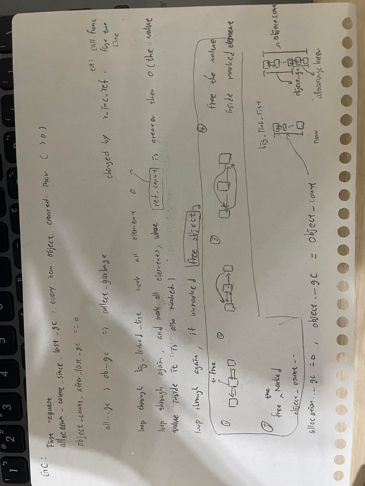

[Type](./Type.txt) 所有的類型

## value_t

value_t 是閉包功能的關鍵 因為同樣一個結構 可以放入 number, object(uion: dict, string, func) 和 null不能的資料

他以可能犧牲一些空間 來達成像是弱型態的功能

**Example:**

object_t 的類型為string時佔用的內存,     原本string 是char* 只要佔8byte, 但是union佔用的內存等於最長的成員佔用的內存 所以最後還是以32byte存下來(func的類型大小)

 

| 名子       | 類型         | 內容                                                         | 來自    |
| ---------- | ------------ | ------------------------------------------------------------ | ------- |
| value_t    | struct value | struct value                                                 | value.h |
| value_type | enum         | value_type_null, <br>value_type_number,<br>value_type_object, | value.h |
| value      | struct       | enum value_type type; <br>union  {<br>   object_t *object;<br>   double number;<br>} | value.h |


## object_t

Toyjs幾乎所有資料都是用value_t儲存, 而value_t只有三個類型 number和object_t和null, 且object_t又有分成許多類型 dict, list, string 和func 所以大部分情況下object_t 被大量的創造,  GC就是來回收那些object_t, 利用big_link_list追蹤object_t們標記再回收

| 名子        | 類型          | 內容                                                         | 來自     |
| ----------- | ------------- | ------------------------------------------------------------ | -------- |
| value_t     | struct value  | struct value                                                 | value.h  |
| value       | struct        | enum value_type type; <br>union  {<br>   object_t *object;<br>   double number;<br>} | value.h  |
| object_t    | struct object | struct object                                                | object.h |
| object_type | enum          | object_type_dict,<br>object_type_list,<br>object_type_string,<br>object_type_func | object.h |
| object      | struct        | enum object_type type; <br>object_t *pre, *next; <br>int marked, ref count; <br>union {<br>   dict_t dict; <br>   char  * string ;<br>   func_t fun;<br>} | object.h |

每當創造新的object_t時 會跑這個code 再一依照不同類型 做不同的初始化

以下是創造object_t必跑的

```c
static object_t *new_object(void) {
    object_count++; //總共的object數目
    allocation_count_since_last_gc++; //從上次GC的清理過後 累積到現在的object數目
    object_t *o = xmalloc(sizeof(object_t));
    o->ref_count = 0;
    o->prev = 0;
    o->next = big_linked_list; 
    if (big_linked_list) {
        big_linked_list->prev = o;
    }
    big_linked_list = o; //紀錄最後創造object的位置
    return o;
}
```

`big_linked_list` 把所有的object_t連在一起的幫手 並也指向了最後一個object的位置 可以藉由他遍歷整個物件池

以下是object_t是如何連在一起的過程


## 不同類型的object_t

### string object

跟上面的一樣 當新的object_t創造 會先與其他object連接好讓big_link_list可以遍歷  在跑各自的初始化

string的初始化是 複製參數的值到object_t裡面的string

```c
object_t *new_string_object(const char *cs) {
    object_t *o = new_object(); 
    o->type = object_type_string;
    o->string = xstrdup(cs); // 複製cs字串 到 o->string字串
    return o;
}
```

小幫手的巨集 快速的創好object是string類型的value_t

```c
#define v_string(cstr)                          \
    ((value_t){                                 \
        .type = value_type_object,              \
        .object = new_string_object(cstr),      \
    })
```

### dict object

dict 是 字典 不過這裡的字典查詢方式比較像以串鍊的方式遍歷搜尋

dict 被用來使用在許多地方 不只是用於`example = { arg1 : 1, arg2: 2};` 的情況

他也被用於 scope(scope是用來知道目前為止宣告了什麼), 可以藉由在dict_t搜尋key  來找之前宣告過的 變數, 函式, 甚至是 module(因為value用value_t的結構儲存 所以可以很方便拿到看起來不同類型的東西)

#### 創造

創造object_t把o->dict指向0的位置  這裡還沒有創造dict_entry 只是個指標用來指向dict_entry

```c
object_t *new_dict_object(void) {
    object_t *o = new_object();
    o->type = object_type_dict;
    memset(&o->dict, 0, sizeof(dict_t));
    return o;
}
```

#### 創造dict_entry

| 名子         | 類型              | 內容                                                         | 來自   |
| ------------ | ----------------- | ------------------------------------------------------------ | ------ |
| dict_entry   | struct            | char*  key; <br>value_t   value; <br>dict_entry_t   *pre, *next; | dict.h |
| dict_t       | dict_entry_t *    | dict_entry_t *                                               | dict.h |
| dict_entry_t | strcut dict_entry | strcut dict_entry                                            | dict.h |


這裡就是創造dict_entry了 用dict_t* 在dict_t串鍊中尋找有沒有相同的key (這裡可以看到 他都是由最前端端遍歷 )有的話 把那個dict的value 改成參數的value

找不到  且如果這是這個dict_t串鍊第一個 就把它當頭並把串鍊指向他 

​				如果不是第一個 	創造dict_entry把它放在dict串鍊的前端 再把串鍊指向創造出來的dict_entry  

```c
static dict_entry_t *dict_find_entry(dict_t *dict, const char *key) {
    for (dict_entry_t *e = *dict; e; e = e->next) {
        if (strcmp(e->key, key) == 0) {
            return e;
        }
    }
    return 0;
}

void dict_set(dict_t *dict, const char *key, value_t v) {
    dict_entry_t *entry = dict_find_entry(dict, key);
    if (entry) {
        entry->value = v;
        return;
    }
    entry = xmalloc(sizeof(dict_entry_t));
    entry->key = xstrdup(key);
    entry->value = v;
    entry->next = *dict;
    entry->prev = 0;
    if (*dict) {
        (*dict)->prev = entry;
    }
    *dict = entry;
}
```

小幫手 快速創造object_t類型是dict的value_t

```c
#define v_dict()                                \
    ((value_t){                                 \
        .type = value_type_object,              \
        .object = new_dict_object(),            \
    })
```


以下是dict創造的流程




### func object

類型是func的object_t 是個比較複雜的結構,  func結構裡有compiled和native和parent_scope

func:

* compiled 

  裝經過codegen()處理好的函式 

  * parm_name: 函式參數的名稱 , 在解析函式時會依照這個名稱 在scope中尋找

  * code: opcode的形式 , 有點像是機器碼 不過是操作的對象是 那些value_t,scope(value_t)和stack_t
  * consts: 和bconsts是對應的 當codegen()處理好函式時 會先把函式需要用到的名稱和數字裝在bconsts, 之後consts在依照bconsts的值 轉成value_t 統一起來 在分析函式(eval_func)時比較方便
  * bconsts: compile.js處理好函式時 會先把函式需要用到的名稱和數字裝在這
  * count: 數字和名稱的總數量
  * file: 用來找到同一個檔案中的其他函式

* native

  他是在Toyjs中 自己定義好的函式

* parent_scope

  當eval_func 裡的 opcode_load_func 時 他會設定 parent_scope 在哪個scope下宣告的 當在尋找上一層或更上層的scope時 可以藉由這個遞迴回去找

  ```c
  static value_t scope_lookup(value_t scope, const char *name) {
      if (dict_has(&scope.object->dict, name)) {
          return scope;
      }
      value_t parent = dict_get(&scope.object->dict, "<parent>");
      if (!v_is_null(parent)) {
          return scope_lookup(parent, name); //遞迴
      }
      return v_null;
  }
  ```

  

| 名子          | 類別   | 類容                                                         | 來自     |
| ------------- | ------ | ------------------------------------------------------------ | -------- |
| compiled_func | strcut | char *param_name;<br>unsigned char *code;<br>value_t *consts;<br>struct bvalue *bconsts;<br>size_t const_count;<br>compiled_file_t *file; | vm.h     |
| func          | struct | struct compiled_func * compiled; <br/>native_func_t native;<br/> value_t parent_scope; | object.h |
| object        | struct | enum object_type type; <br>object_t *pre, *next; <br>int marked, ref count; <br>union {<br>   dict_t dict; <br>   char  * string ;<br>   func_t func;<br>} | object.h |



#### 創造

創造這func object同樣都會跑先跑這個函式

```c
///object.c
static object_t *new_func_object(func_t func) {
    object_t *o = new_object();
    o->type = object_type_func;
    o->func = func;
    return o;
}
object_t *new_native_func_object(native_func_t native) {
    return new_func_object((func_t){
        .compiled = 0,
        .native = native,
        .parent_scope = v_null,
    });
}

object_t *new_compiled_func_object(compiled_func_t *compiled) {
    //創造一個新的函式物件 並把指標指向files裡funcs的第一個func
    return new_func_object((func_t){
        .compiled = compiled,
        .native = 0,
        .parent_scope = v_null,
    });
}
```

## Garbage collector

當需要空間時 GC 會從big_linked_list 一路遍歷到第一個創造的物件

```c
void collect_garbage(void) {
    for (object_t *o = big_linked_list; o; o = o->next) { // 把所有的物件標記為零
        o->marked = 0;
    }
	// 當 ref_count 不為零時標記
    // ref_count 的數字代表有其他的物件在 使用他 不能被回收
    for (object_t *o = big_linked_list; o; o = o->next) {
        if (o->ref_count) {
            mark_object(o);
        }
    }

    object_t *o = big_linked_list;
    while (o) {//在遍歷一次把沒有被標記的回收
        object_t *next = o->next;
        if (!o->marked) {
            free_object_unsafe(o);
        }
        o = next;
    }
}

void request_garbage_collection(void) {
    if (allocation_count_since_last_gc > object_count_after_last_gc) {
        collect_garbage();
        allocation_count_since_last_gc = 0;
        object_count_after_last_gc = object_count;
    }
}
```

以下是GC回收的過程

